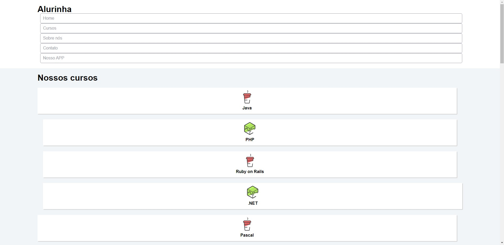

Para o começar o estudo do atributo flexbox, a Alura disponibilizou a página HTML e CSS com toda estrutura e estilos iniciais. 

Por padrão, todas as divs/estruturas vieram posicionadas umas abaixo das outras. 

